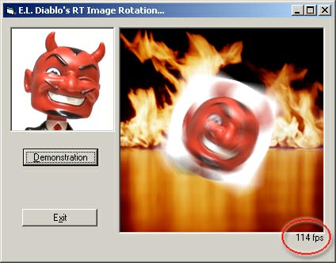



## Realtime Image Rotation \( 114 frames / sec \) using PlgBlt

### Description

I've seen many Image Rotation functions and this code might already be on PSC in some other shape or form, but most others rotate pixels by pixel wich is super duper slow. This function uses PlgBlt and hit 114 frames per second on my (1GHz) machine! CHECK SCREENSHOT for example. Code is pretty simple and commented. Have fun. Danny,--
 
### More Info
 

             |
---                |---
**Submitted On**   |2002-08-05 10:54:48
**By**             |[DANNY van der Ark](https://github.com/Planet-Source-Code/PSCIndex/blob/master/ByAuthor/danny-van-der-ark.md)
**Level**          |Beginner
**User Rating**    |4.6 (37 globes from 8 users)
**Compatibility**  |VB 6\.0
**Category**       |[Graphics](https://github.com/Planet-Source-Code/PSCIndex/blob/master/ByCategory/graphics__1-46.md)
**World**          |[Visual Basic](https://github.com/Planet-Source-Code/PSCIndex/blob/master/ByWorld/visual-basic.md)
**Archive File**   |[Realtime\_I114488852002\.zip](https://github.com/Planet-Source-Code/danny-van-der-ark-realtime-image-rotation-114-frames-sec-using-plgblt__1-37640/archive/master.zip)

